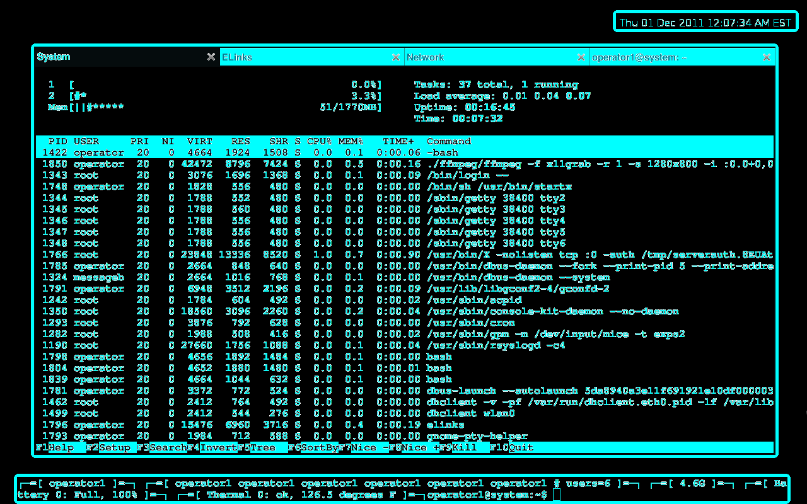
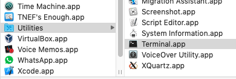
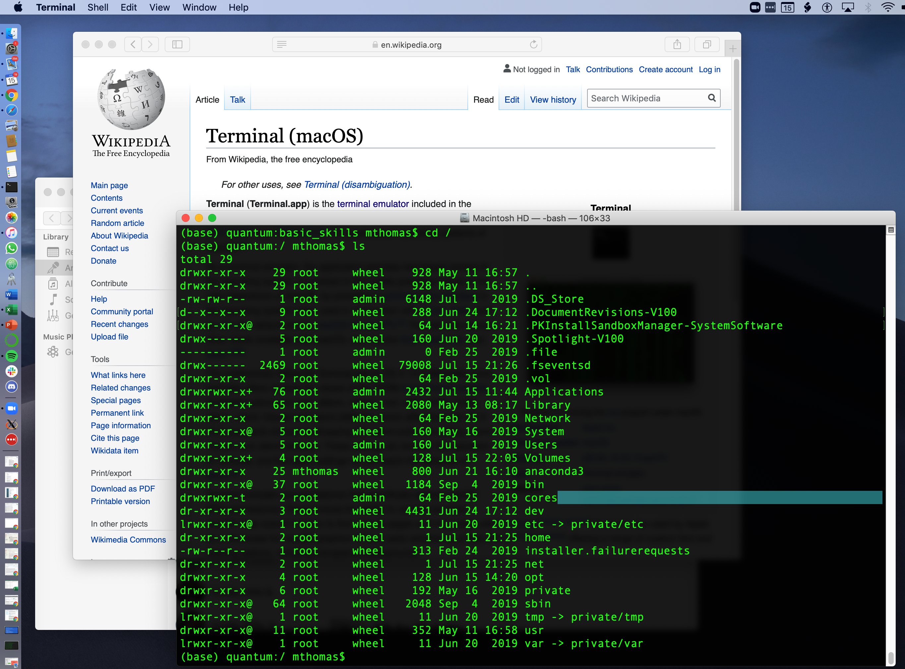
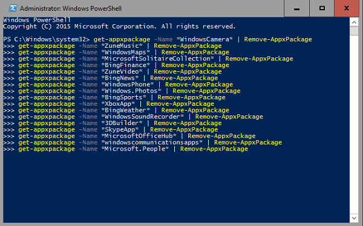

# Connecting to your Comet.sdsc.edu Account
[//]: # " Comment example "

[//]: # ( Comment2 )

To connect to an SDSC HPC system, you need the following:
* A *comet* account.
* A *terminal* client running on your laptop that can be used to connect to Comet. 
* The *SSH* application running in the terminal to make the connection. 


Terminal applications are used to connect clients (you and your laptop) to remote computers (such as Comet). See https://en.wikipedia.org/wiki/Terminal_emulator for more information. The best known example of using a terminal is for logging in/connecting to a remote computer systems by users. This is called a client-server connection. Terminals are interactive: you type in a command to run, and the outputs are displayed on the terminal. Executing any command is done by typing it and pressing Enter.

SSH provides a secure channel over any network in a client-server architecture (see https://en.wikipedia.org/wiki/Secure_Shell). You will be using your laptop to access SDSC’s HPC systems using the secure shell command `ssh`. It is essential that you be able to run secure shell (or a similar connection tool) with X11 forwarding enabled, which allows you to have data encryption and to launch windows applications (e.g. plotting, or a browser).

This tutorial can be used to verify that your account is working, that your laptop is properly configured, and that your Comet user environment is correctly setup. If you are new to Unix, please see the [Basic Linux Skills](https://github.com/sdsc-hpc-training-org/basic_skills) tutorial.

<a name="top">Contents:
    
* [Read the Comet User Guide](#comet-guide)
* [Obtain your Comet account](#comet-account)
* [Install/Locate the Terminal App](#term-app)
    - [Linux ](#term-linux)
    - [Mac](#term-mac)
    - [Windows ](#term-windows)
        - [Windows 10](#term-windows10)
        - [Windows (pre-Win10)](#term-windows-older)
* [Install/Locate Secure Shell (SSH) App](#ssh)
* [Terminal Connection Example](#connect-example)
    - [Getting Domain Name & Host Information](#dn-info)
    - [Making the Connction](#connection)

Note: if you have any difficulties completing these tasks, please contact Institute staff at <consult@sdsc.edu>.

## Read the Comet User Guide <a name="comet-guide"></a>

Please read the Comet user guide and familiarize yourself with the hardware, file systems, batch job submission, compilers and modules. The guide can be found here:
http://www.sdsc.edu/support/user_guides/comet.html

Once you are logged onto Comet, you can begin working with your code. For more help on using Comet, see the [Comet 101](https://github.com/sdsc-hpc-training-org/comet-101) tutorial
 
## Obtain your Comet account <a name="comet-account"></a>

To obtain a trial Comet account see the Comet user guide at  http://www.sdsc.edu/support/user_guides/comet.html#trial_accounts

You will be directed to the *XSEDE portal*, where you will create a *Portal User account*. Information from that account will be used to set up your *trial* Comet account. Note that the Portal account name and the Comet account name may be different, so keep track of them both. The Comet account can then be used for all Comet allocations.

[Back to Top](#top)
<hr>


## Locate/Install the Terminal App <a name="term-app"></a>


*NOTE: The `hostname` for Comet is `comet.sdsc.edu`


[Back to Top](#top)
<hr>

## <a name="term-linux"></a>Linux 
There are a lot of terminal emulators available for Linux. See http://www.linuxandubuntu.com/home/10-best-linux-terminals-for-ubuntu-and-fedora for a 'Top 10' List. A very popular terminal is the [Gnome]() terminal, which is included in the Linux distribution software. 


(Image Source from http://www.necopost.com/2011/11/gnome-terminal-as-lightweight-desktop.html)


## <a name="term-mac"></a>Mac 
For Mac  users, the *Terminal* application is typically used for connections. The application can be found in the */Applications/Utilities* folder:



The terminal launches on the Mac Desktop like other applications, and uses an interactive command-line based interface:


Note that for macs, if you want to run applications on the remote that involves visualization or user GUIs such as Jupyter Notebooks, R-Studio, or Matlab, you will need to install [XQuartz](https://www.xquartz.org/) which launches an X11-type app. For more info, see 

[Back to Top](#top)
<hr>

### <a name="term-windows"></a>MSFT Windows 
All windows users will need to run a terminal emulation application capable of supporting an X Server and an ssh-like client.

**Windows 10** <a name="term-windows10"></a>
Windows 10 has a new terminal app called *Windows Terminal*, which is a terminal emulator for Windows 10 written by Microsoft. It includes support for the Command Prompt, PowerShell, WSL and SSH and other commands. While not a full Unix OS, it has shown to be very popular and useful within the HPC community. MSFT has created a GitHub repo with source code, installation and documentation here:
   * https://github.com/Microsoft/Terminal



[Back to Top](#top)
<hr>

**Windows** (pre-Win10) <a name="term-windows-older"></a> 
Older Windows users will need to run an X Server and an ssh-like client. [Cygwin](https://www.cygwin.com) provides a comprehensive Linux-like environment and an X server (Cygwin/X). Putty will also work for direct access to Comet, it is only used for file transfers. For download and installation instructions, see:

   * http://www.cygwin.com/
   * http://x.cygwin.com/
   * https://www.putty.org/
   
[Back to Top](#top)
<hr>


## InstallLocate Secure Shell (SSH) App <a name="ssh"></a>
For connecting to SDSC systems, we recommend using [Secure Shell (SSH)](https://en.wikipedia.org/wiki/Secure_Shell). 

*NOTE:* Using Null passphrase SSH public keys is *not* recommended for SDSC HPC systems; to automate your connections use the SSH-Agent command. For more information, see the [SDSC Security Repo](https://github.com/sdsc-hpc-training-org/hpc-security)
 
[Back to Top](#top)
<hr>

## Terminal Connection Example <a name="connect-example"></a>

### Getting Domain Name & Host Information <a name="dn-info"></a>
Each machine you work with will have a `<domain_name>`,  `<hostname>` or `<ip_address>`. You can learn about IP addresses and domain names here: https://computer.howstuffworks.com/dns.htm.

* NOTE: The *DN* (domain name) for Comet is    `comet.sdsc.edu`

You may need to know the physical IP address of the cluster. To do this, run the `nslookup` command from the command line of your local terminal window (or on `comet` if are logged in)
```
[username@laptop:] nslookup comet.sdsc.edu
Server:		192.168.86.1
Address:	192.168.86.1#53

Non-authoritative answer:
Name:	comet.sdsc.edu
Address: 198.202.113.252
Name:	comet.sdsc.edu
Address: 198.202.113.253
```

The public IP address appears under the line labeled "Non-authoritative answer:" and for Comet there are two. 
* Comet's DN is. comet.sdsc.edu
* Comet's IP address is 198.202.113.252 and 198.202.113.253. 

You can log onto Comet using either the DN or the IP addresses. 

[Back to Top](#top)
<hr>


### Making the Connection <a name="connection"></a>
```
[localuser@localhost]: ssh -X username@comet.sdsc.edu
Password: 
Last login: Tue Jul 14 09:13:28 2020 from 12.345.678.91
Rocks 7.0 (Manzanita)
Profile built 13:03 03-Dec-2019

Kickstarted 14:18 03-Dec-2019
                                                                       
                      WELCOME TO 
      __________________  __  _______________
        -----/ ____/ __ \/  |/  / ____/_  __/
          --/ /   / / / / /|_/ / __/   / /
           / /___/ /_/ / /  / / /___  / /
           \____/\____/_/  /_/_____/ /_/

###############################################################################
NOTICE:
The Comet login nodes are not to be used for running processing tasks. 
This includes running Jupyter notebooks and the like.  All processing 
jobs should be submitted as jobs to the batch scheduler.  If you don’t 
know how to do that see the Comet user guide 
https://www.sdsc.edu/support/user_guides/comet.html#running.
Any tasks found running on the login nodes in violation of this policy
 may be terminated immediately and the responsible user locked out of 
the system until they contact user services.
###############################################################################
[username@comet-ln3 ~]$
```


[Back to Top](#top)
<hr>

